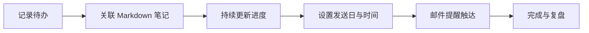

# Personal Todo Vault

> 把待办变成可追踪、可提醒、可复盘的个人工作台。

一个面向**个人使用与私有部署**的待办事项服务：待办、进度、提醒和 Markdown 笔记保存在你自己的设备上；可选地通过坚果云 WebDAV 做加密配置下的云端备份。项目使用原生 Node.js HTTP 服务与 SQLite（sql.js），不依赖前端框架或外部 SaaS。

<p align="center">
  <a href="https://github.com/nerkeler/personal-todo-vault"></a>
  <a href="https://github.com/nerkeler/personal-todo-vault/blob/main/LICENSE"></a>
  
  
</p>

> [!WARNING]
> 本项目目前**没有登录、权限管理或多用户隔离机制**。请只部署在可信的本机、局域网、VPN 或已由反向代理提供身份验证的网络中；**不要直接将端口暴露到公网**。

## 先看效果

<p align="center">
  
</p>

<p align="center"><sub>待办、分类、进度和完成概览集中在一个清爽的个人工作台里。</sub></p>

<p align="center">
  
</p>

<p align="center"><sub>提醒支持常用时间、5 分钟刻度、小时/分钟微调，也可以直接输入时间。</sub></p>

> 截图使用脱敏示例数据；实际待办、笔记、数据库和配置都留在你的运行环境中。

## 为什么它不同于一般待办应用？

- **一条待办，一份 Markdown 上下文**：每个待办都有独立笔记，可记录目标、步骤、链接、复盘和资料，而不是只有一行标题。
- **个人优先、数据在自己手里**：运行数据是本机 SQLite 数据库和 Markdown 文件；无需注册第三方账户，也不把待办上传到应用服务商。
- **为长期事项设计的进度与提醒**：支持 0–100% 进度，达到 100% 自动完成；提醒可单次、每周指定星期持续重复，或按指定次数重复。
- **提醒时间不再难选**：常用时段一键选择，分钟支持 5 分钟刻度，小时和分钟可以独立微调，也能直接键盘输入。
- **关联笔记真正参与提醒**：Markdown 笔记会解析成可读的 HTML 放进提醒邮件，而不是把 Markdown 源码原样塞进邮件。
- **安全的配置中心**：邮件和坚果云设置均在页面中保存、测试；密码不会回显，保存时使用 AES-256-GCM 加密，密钥与配置文件均不进入 Git。
- **适合自托管的云端备份**：数据库和每份 Markdown 笔记分别进行 SHA-256 内容寻址、gzip 压缩和增量上传；每次备份保留完整快照清单，不是简单覆盖一个压缩包。
- **低依赖、便于私有部署**：原生 HTML/CSS/JavaScript + Node.js 原生 HTTP + SQLite WASM，部署和迁移简单。

## 功能一览

- 待办创建、编辑、完成、删除，按分类筛选
- 自定义分类、图标、分类排序
- 每条待办关联独立 Markdown 笔记，支持编辑、保存与安全预览
- 进度记录（0–100%），100% 自动标记完成
- 完成进度概览，重点展示当前待完成工作
- 明暗主题与移动端适配
- 邮件提醒：单次、每周指定星期、指定次数重复；已完成待办自动停止提醒
- 提醒时间：常用时间快捷项、5 分钟网格、加减微调和直接输入
- 配置中心：SMTP、收件人、坚果云 WebDAV、自动备份间隔，均可保存和测试
- 坚果云 WebDAV 增量备份数据库与 Markdown 笔记
- SQLite 原子写入、本地滚动备份（默认保留最近 10 份）
- 兼容从旧版 `data.json` 迁移到 SQLite

## 一个任务的完整闭环



## 示例：把一个想法变成可执行事项

### 1. 给任务补上上下文

每条待办都可以关联一份 Markdown 笔记，例如：

```markdown
## 本周目标

把个人项目整理成一篇可以分享给朋友的介绍。

## 下一步

- [ ] 补充项目截图
- [ ] 写清楚快速开始
- [ ] 检查隐私与部署安全说明

## 参考

- 产品主页
- 发布清单
```

笔记在应用内支持编辑和安全预览；触发提醒时会被渲染成更适合阅读的 HTML 邮件内容。

### 2. 设置一个不容易忘记的提醒

| 设置项 | 示例 |
|---|---|
| 重复方式 | 每周重复 |
| 发送日 | 工作日 |
| 提醒时间 | 09:00，或按 5 分钟刻度选择 |
| 接收邮箱 | 当前任务单独指定，或使用全局收件人 |

单次提醒成功后会自动关闭；重复提醒会在任务完成或达到指定次数后停止。

## 最近更新

- **Markdown 邮件渲染**：提醒邮件现在会把关联笔记解析为可读内容，并保留纯文本备用版本。
- **现代化时间选择器**：增加常用时间、分钟刻度、小时/分钟微调和输入校验，减少配置提醒时间的操作成本。

## 技术栈

| 层级 | 实现 |
|---|---|
| 前端 | 单文件原生 HTML、CSS、JavaScript |
| 服务端 | Node.js 原生 `http` 模块 |
| 数据库 | `sql.js`（SQLite WebAssembly） |
| 邮件 | `nodemailer` |
| 笔记 | 本地 `notes/<todo-id>.md` |
| 云端备份 | 坚果云 WebDAV（标准 Basic Auth） |

## 快速开始

### 要求

- Node.js **20 或更高版本**
- npm

```bash
git clone https://github.com/nerkeler/personal-todo-vault.git
cd personal-todo-vault
npm ci
npm start
```

默认只绑定本机地址，打开：<http://127.0.0.1:8238/>。

首次启动会创建：

```text
todo.db        # SQLite 数据库（个人数据，不提交）
notes/         # 每条待办的 Markdown 笔记（个人数据，不提交）
backups/       # 本地数据库滚动备份（个人数据，不提交）
config.local.* # 加密的配置与机器本地密钥（不提交）
```

## 网络访问与安全

### 本机访问（推荐开发环境）

```bash
npm start
```

默认监听 `127.0.0.1:8238`，只能由当前设备访问。

### 局域网访问

仅在可信局域网内使用时，绑定全部网卡：

```bash
HOST=0.0.0.0 PORT=8238 npm start
```

之后可使用服务器局域网 IP 加端口访问，例如 `http://<server-lan-ip>:8238/`。

> 因为应用没有内置登录，局域网中能访问该地址的人都能读取和修改待办数据。需要跨网络访问时，请优先使用 Tailscale、WireGuard 等 VPN；或在 Nginx/Caddy 后增加 HTTPS 与身份验证。不要通过路由器端口映射直接公开服务。

## 部署

### 方式一：直接运行

适合开发、个人电脑或已有进程守护工具的环境：

```bash
cd /path/to/personal-todo-vault
npm ci
HOST=0.0.0.0 PORT=8238 npm start
```

### 方式二：systemd（Linux 常驻服务）

1. 将项目放到专用目录，并安装依赖：

   ```bash
   sudo mkdir -p /opt/personal-todo-vault
   sudo chown "$USER":"$USER" /opt/personal-todo-vault
   git clone https://github.com/nerkeler/personal-todo-vault.git /opt/personal-todo-vault
   cd /opt/personal-todo-vault
   npm ci
   ```

2. 创建 `/etc/systemd/system/personal-todo-vault.service`：

   ```ini
   [Unit]
   Description=Personal Todo Vault
   After=network.target

   [Service]
   Type=simple
   User=YOUR_LINUX_USER
   WorkingDirectory=/opt/personal-todo-vault
   Environment=NODE_ENV=production
   Environment=HOST=127.0.0.1
   Environment=PORT=8238
   ExecStart=/usr/bin/node /opt/personal-todo-vault/server.js
   Restart=on-failure
   RestartSec=5

   [Install]
   WantedBy=multi-user.target
   ```

   将 `YOUR_LINUX_USER` 改为实际 Linux 用户。若明确只在可信局域网内使用，可把 `HOST=127.0.0.1` 改为 `HOST=0.0.0.0`。

3. 启用并查看状态：

   ```bash
   sudo systemctl daemon-reload
   sudo systemctl enable --now personal-todo-vault
   sudo systemctl status personal-todo-vault
   ```

4. 常用运维命令：

   ```bash
   sudo systemctl restart personal-todo-vault
   sudo journalctl -u personal-todo-vault -f
   ```

### 更新部署

先在页面执行一次云端或本地备份，再更新代码：

```bash
cd /opt/personal-todo-vault
git pull --ff-only
npm ci
sudo systemctl restart personal-todo-vault
```

运行数据、加密配置和本地备份目录已经在 `.gitignore` 中，不会被 `git pull` 覆盖。

## 配置中心

点击页面右上角的齿轮可打开唯一配置入口。邮件和坚果云配置都可以输入、保存和连接测试。

### 邮件提醒（SMTP）

可设置 SMTP 服务器、端口、SSL/TLS、账号、授权码、发件人名称、发件人邮箱和收件人。

- 密码/授权码只写入本机加密配置，页面不会回显明文。
- 先点击“保存配置”，再点击“测试邮件”。
- 许多邮箱服务要求使用**应用密码/授权码**，而不是网页登录密码。
- 每分钟由服务端检查提醒；每条待办每天最多发送一次。

提醒模式：

| 模式 | 行为 |
|---|---|
| 单次 | 到达设定时间后发送一次，并自动关闭 |
| 每周重复 | 在选中的星期按时持续发送，直到手动关闭或待办完成 |
| 重复 N 次 | 在选中的星期发送，累计达到设定次数后自动关闭 |

### 坚果云 WebDAV 备份

在配置中心填写并保存：

```text
WebDAV 地址：https://dav.jianguoyun.com/dav/
账号：坚果云登录邮箱/账号
应用密码：坚果云「第三方应用密码」，不是网页登录密码
备份目录：todo-app-backups（可自行修改）
```

保存后可点击“测试坚果云”，成功后再点击“立即备份”。应用密码请在坚果云的「安全选项 / 第三方应用管理」中创建。

#### 备份结构与策略

```text
todo-app-backups/
├── objects/
│   ├── database/<sha256>.db.gz
│   └── notes/<sha256>.md.gz
├── snapshots/<timestamp>-<random>.json
└── latest.json
```

- `todo.db` 和每个 Markdown 笔记独立计算 SHA-256；只有新内容或变更内容上传，未变化对象会复用。
- 每次备份生成一份完整快照清单；`latest.json` 指向最新快照。
- 删除的笔记不会出现在最新快照中；历史快照和对象默认保留，便于保留历史版本。
- 这是**单向备份**，不是双向同步。请不要直接在坚果云目录中编辑对象文件。
- WebDAV 密码和本机配置密钥不会上传到坚果云。

## 数据与隐私

以下文件全部是运行时私有数据，默认被 Git 忽略：

| 路径 | 内容 |
|---|---|
| `todo.db` | 待办、分类、提醒等 SQLite 数据 |
| `notes/*.md` | 每条待办关联的 Markdown 笔记 |
| `backups/` | 本机数据库滚动备份 |
| `config.local.json` | AES-GCM 加密后的 SMTP/WebDAV 设置 |
| `config.local.key` | 当前设备的配置加密密钥 |
| `.env` / `.env.local` | 可选环境变量覆盖文件 |
| `data.json` | 旧版导入数据（仅首次迁移时使用） |

### 配置加密说明

页面保存的配置写入 `config.local.json`，整个配置包使用 AES-256-GCM 加密；机器本地密钥保存在 `config.local.key`，或由 `TODO_CONFIG_SECRET` 环境变量提供。

- 请同时妥善备份 `config.local.json` 和 `config.local.key`；只有配置文件而没有同一把密钥时，无法解密密码。
- 不要把这两个文件、应用密码或数据库提交到 Git，也不要发到聊天记录中。
- 需要在另一台服务器恢复配置时，可在安全渠道迁移这两个文件，或重新在配置中心填写配置。

## 可选环境变量

配置中心是首选方式。以下变量适合首次部署、自动化或无界面环境提供默认值：

```bash
# 服务绑定
HOST=127.0.0.1
PORT=8238

# SMTP
TODO_SMTP_HOST=smtp.example.com
TODO_SMTP_PORT=465
TODO_SMTP_SECURE=true
TODO_SMTP_USER=your-account@example.com
TODO_SMTP_PASS=your-smtp-app-password
TODO_SMTP_FROM=your-account@example.com
TODO_MAIL_RECIPIENTS=recipient@example.com

# 坚果云 WebDAV
TODO_WEBDAV_URL=https://dav.jianguoyun.com/dav/
TODO_WEBDAV_USERNAME=your-jianguoyun-account@example.com
TODO_WEBDAV_PASSWORD=your-jianguoyun-app-password
TODO_WEBDAV_BACKUP_DIR=todo-app-backups
TODO_BACKUP_AUTO=false
TODO_BACKUP_INTERVAL_HOURS=24
```

可以复制 `.env.example` 作为自己的本地参考文件，但服务不会自动读取 `.env`；请通过 systemd `Environment=`、Shell 环境变量或其他进程管理工具注入。

## 数据迁移与恢复

- 若首次启动时不存在 `todo.db`、但根目录存在旧版 `data.json`，服务会自动迁移数据到 SQLite。
- 已存在 `todo.db` 时不会重复导入 `data.json`。
- 本地保存采用临时文件、`fsync` 和原子替换，并保留最近 10 份滚动数据库备份。
- 坚果云备份目前提供增量上传与完整快照清单；恢复流程应根据快照清单取回相应数据库/笔记对象。执行恢复前，请先停止服务并备份现有运行目录。

## API 概览

所有 JSON 请求使用 `Content-Type: application/json`。普通 JSON 请求体上限 2 MiB，Markdown 笔记请求体上限 4 MiB。

| Method | Endpoint | 说明 |
|---|---|---|
| GET / POST | `/api/categories` | 获取或创建分类 |
| PATCH / DELETE | `/api/categories/:id` | 修改或删除分类 |
| PATCH | `/api/categories/reorder` | 调整分类顺序 |
| GET / POST | `/api/todos` | 获取或创建待办，可用 `?categoryId=` 过滤 |
| PATCH / DELETE | `/api/todos/:id` | 更新或删除待办、进度、提醒 |
| GET / PUT | `/api/todos/:id/note` | 读取或保存关联 Markdown 笔记 |
| GET / PUT | `/api/settings` | 读取或保存脱敏后的统一配置 |
| POST | `/api/settings/test-email` | 测试 SMTP 配置 |
| GET | `/api/backup/status` | 获取坚果云备份状态（不返回密码） |
| POST | `/api/backup/test` | 测试坚果云 WebDAV 配置 |
| POST | `/api/backup/run` | 立即上传云端备份 |
| GET | `/api/icons` | 获取预设分类图标 |

待办 API 使用 camelCase 字段，例如 `categoryId`、`createdAt`、`reminderEnabled`、`reminderTime`、`reminderMode`、`reminderWeekdays`、`reminderRepeatCount`、`creatorEmail`、`noteFile`。

## 项目结构

```text
personal-todo-vault/
├── appConfig.js       # 加密的本地配置读取、保存与脱敏输出
├── cloudBackup.js     # WebDAV 内容寻址增量备份
├── email.js           # SMTP 邮件与测试邮件
├── index.html         # 前端页面（原生 HTML/CSS/JS）
├── server.js          # HTTP API、提醒与备份定时器
├── sqlite.js          # SQLite 初始化、迁移与原子保存
├── sql-wasm.*         # SQLite WASM 运行时
├── notes/.gitkeep     # 空笔记目录占位；真实笔记不提交
├── docs/screenshots/  # README 展示用的脱敏界面截图
├── .env.example       # 不含秘密的环境变量示例
├── SPEC.md            # 产品与技术规格
└── package.json       # Node.js 依赖与脚本
```

## 开发检查

```bash
npm run check
```

## 公开仓库约定

本仓库只包含应用代码、文档和无敏感信息的示例文件；不包含真实待办、Markdown 笔记、SQLite 数据库、备份、密码、应用授权码或历史提交记录。部署后产生的个人数据始终保留在你自己的运行环境中。
