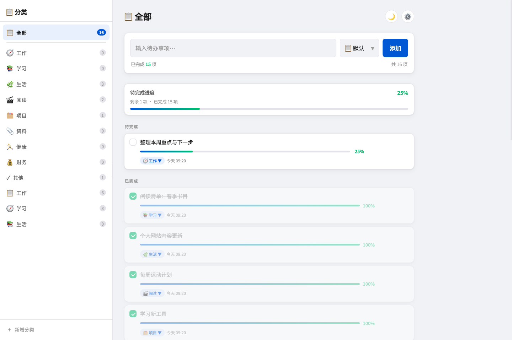
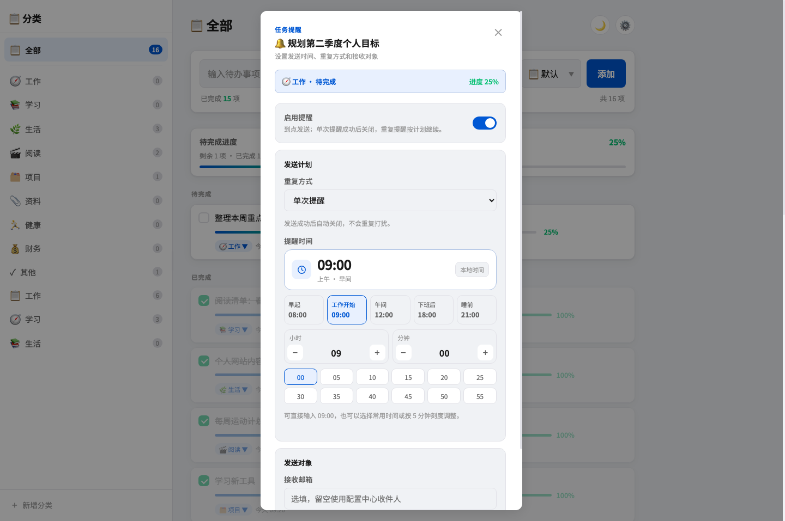
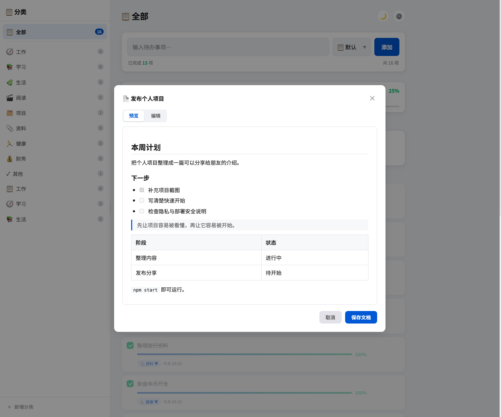
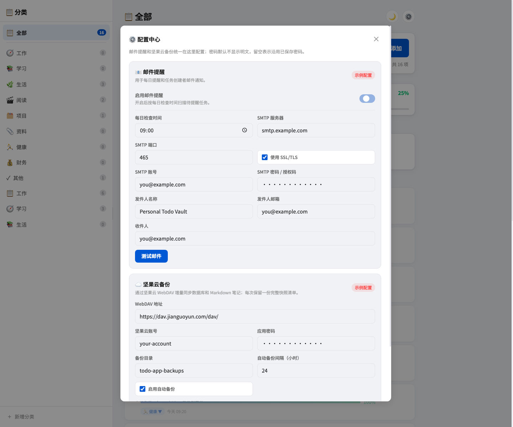
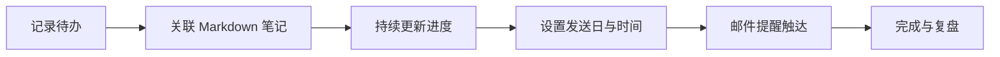

# Personal Todo Vault

> 个人任务、进度、邮件提醒与 Markdown 笔记的本地化管理服务。

一个面向个人使用与私有部署的待办服务：任务、进度、提醒和 Markdown 笔记保存在自己的设备上，也可以通过坚果云 WebDAV 做增量备份。备份对象只做 gzip 压缩和完整性校验，**不加密**。

<p align="center">
  <a href="https://github.com/nerkeler/personal-todo-vault"></a>
  <a href="https://github.com/nerkeler/personal-todo-vault/blob/main/LICENSE"></a>
  
  
</p>

> [!WARNING]
> 项目目前没有登录、权限管理或多用户隔离机制。请只部署在可信的本机、局域网、VPN 或已由反向代理提供身份验证的网络中，不要直接将端口暴露到公网。

## 运行实例图

<p align="center">
  
</p>

<p align="center"><sub>主界面集中展示分类、进度和待完成事项。</sub></p>

<table>
  <tr>
    <td width="50%" align="center">
      
      <br><sub>提醒时间选择：常用时段、分钟刻度、加减微调和直接输入</sub>
    </td>
    <td width="50%" align="center">
      
      <br><sub>Markdown 笔记预览：标题、清单、引用、表格和代码</sub>
    </td>
  </tr>
</table>

<p align="center">
  
</p>

<p align="center"><sub>配置中心：SMTP 邮件提醒、坚果云备份及本地加密配置。</sub></p>

## 项目特点

| 项目维度 | 实现方式 |
|---|---|
| 任务上下文 | 每条任务关联一份独立 Markdown 笔记 |
| 进度管理 | 记录 0–100% 进度，达到 100% 自动完成 |
| 邮件提醒 | 支持单次、每周及按次数重复发送 |
| 时间配置 | 常用时间、5 分钟刻度、小时/分钟微调和直接输入 |
| 数据存储 | 本地 SQLite 与 Markdown，可选坚果云 WebDAV 备份 |

## 任务处理流程



## 使用示例

### 给任务补上上下文

```markdown
## 本周目标

把个人项目整理成一篇可以分享给朋友的介绍。

## 下一步

- [x] 补充项目截图
- [ ] 写清楚快速开始
- [ ] 检查隐私与部署安全说明

> 先让项目容易被看懂，再让它容易被开始。
```

应用内可以在“预览 / 编辑”之间切换；标题、任务清单、引用、表格、代码和链接会按可读格式展示。提醒邮件也会把关联笔记解析成 HTML，而不是原样展示 Markdown 源码。

### 提醒配置示例

| 设置项 | 示例 |
|---|---|
| 重复方式 | 每周重复 |
| 发送日 | 工作日 |
| 提醒时间 | 09:00，或选择 09:05 / 09:10 等分钟刻度 |
| 接收邮箱 | 当前任务单独指定，或使用全局收件人 |

单次提醒成功后自动关闭；重复提醒会在任务完成或达到指定次数后停止。

## 配置中心

点击右上角齿轮打开配置中心：

- **邮件提醒**：配置 SMTP 服务器、端口、SSL/TLS、账号、授权码、发件人和收件人，并支持发送测试邮件。
- **坚果云备份**：配置 WebDAV 地址、账号、应用密码、备份目录和自动备份间隔，并支持连接测试与立即备份。
- **任务级提醒**：每条任务可单独启用提醒、选择重复方式、发送日、时间和接收邮箱。
- **本地安全**：密码和授权码使用 AES-256-GCM 加密保存，不进入 Git，也不会上传到备份对象中。

## 快速开始

需要 Node.js **22 LTS 或 24 LTS**（Docker 默认使用 24 LTS）和 npm：

```bash
git clone https://github.com/nerkeler/personal-todo-vault.git
cd personal-todo-vault
npm ci
npm start
```

打开 <http://127.0.0.1:8238/>。请通过 HTTP 地址访问，不要直接双击 `index.html`；页面需要调用同一服务提供的 `/api`。

首次启动会创建 `todo.db`、`notes/`、`backups/` 和 `config.local.*`，这些都是运行时个人数据，默认不会提交到 Git。

```text
todo.db        # SQLite 数据库（个人数据，不提交）
notes/         # 每条待办的 Markdown 笔记（个人数据，不提交）
backups/       # 本地数据库滚动备份（个人数据，不提交）
config.local.* # 加密的配置与机器本地密钥（不提交）
```

## Docker

项目提供 Dockerfile 和 Compose 配置。容器内服务默认监听 `0.0.0.0:8238`，并只使用两个持久化目录：

```text
./data/      → /data    # todo.db、notes/、backups/
./config/    → /config  # config.local.json、config.local.key
```

启动：

```bash
mkdir -p data config
docker compose up -d --build
```

首次从现有本机服务迁移时，先停止旧服务，再把 `todo.db`、`notes/`、`backups/` 复制到 `data/`，把 `config.local.json`、`config.local.key` 复制到 `config/`。不要同时运行旧服务和容器，避免重复提醒或并发写入数据库。

如果需要从旧版 `data.json` 手动生成数据库，脚本会按 `TODO_DATA_DIR` 定位文件，目标数据库已存在时默认拒绝覆盖：

```bash
TODO_DATA_DIR=/data npm run migrate
```

确认要重做迁移时才使用 `npm run migrate -- --force`；覆盖前会把原数据库备份到 `TODO_BACKUP_DIR`（默认 `/data/backups`）。

坚果云同步仍由容器内的 Node 服务通过 HTTPS/WebDAV 执行；只要容器可以访问坚果云，且 `data/` 持久化，增量备份逻辑不变。不要删除这两个目录，也不要使用 `docker compose down -v`，除非确认要删除数据。

容器使用 Node.js 24 LTS，并固定 `TZ=Asia/Shanghai`；提醒时间和日志时间以该时区为准。备份对象不加密，请按明文数据的隐私等级选择坚果云目录。

## 网络访问与安全

### 本机访问（推荐开发环境）

```bash
npm start
```

默认监听 `127.0.0.1:8238`，只能由当前设备访问。

### 局域网访问

仅在可信局域网内使用时，绑定全部网卡：

```bash
HOST=0.0.0.0 PORT=8238 npm start
```

之后可使用服务器局域网 IP 加端口访问，例如 `http://<server-lan-ip>:8238/`。

> 因为应用没有内置登录，局域网中能访问该地址的人都能读取和修改待办数据。需要跨网络访问时，请优先使用 Tailscale、WireGuard 等 VPN；或在 Nginx/Caddy 后增加 HTTPS 与身份验证。不要通过路由器端口映射直接公开服务。

### HTTPS 反向代理来源

Node 进程通常只看到代理与它之间的 HTTP 连接，因此不能用后端 socket 协议推断浏览器的 HTTPS 来源。反代部署时显式设置精确的 Origin 白名单（多个来源用英文逗号分隔）：

```bash
TODO_ALLOWED_ORIGINS=https://todo.example.com
```

只会放行白名单中的 `http://` 或 `https://` Origin；任意未列出的跨源请求都会被拒绝。不要把 `*`、路径、查询字符串或未经确认的用户输入放入该变量，也不要把 `X-Forwarded-Proto` 当作信任配置。直接通过 `http://局域网地址:8238` 访问时无需设置该变量。

## 部署

### 方式一：直接运行

适合开发、个人电脑或已有进程守护工具的环境：

```bash
cd /path/to/personal-todo-vault
npm ci
HOST=0.0.0.0 PORT=8238 npm start
```

### 方式二：systemd（Linux 常驻服务）

1. 将项目放到专用目录，并安装依赖：

   ```bash
   sudo mkdir -p /opt/personal-todo-vault
   sudo chown "$USER":"$USER" /opt/personal-todo-vault
   git clone https://github.com/YOUR_GITHUB_ACCOUNT/personal-todo-vault.git /opt/personal-todo-vault
   cd /opt/personal-todo-vault
   npm ci
   ```

2. 创建 `/etc/systemd/system/personal-todo-vault.service`：

   ```ini
   [Unit]
   Description=Personal Todo Vault
   After=network.target

   [Service]
   Type=simple
   User=YOUR_LINUX_USER
   WorkingDirectory=/opt/personal-todo-vault
   Environment=NODE_ENV=production
   Environment=HOST=127.0.0.1
   Environment=PORT=8238
   ExecStart=/usr/bin/node /opt/personal-todo-vault/server.js
   Restart=on-failure
   RestartSec=5

   [Install]
   WantedBy=multi-user.target
   ```

   将 `YOUR_LINUX_USER` 改为实际 Linux 用户。若明确只在可信局域网内使用，可把 `HOST=127.0.0.1` 改为 `HOST=0.0.0.0`。

3. 启用并查看状态：

   ```bash
   sudo systemctl daemon-reload
   sudo systemctl enable --now personal-todo-vault
   sudo systemctl status personal-todo-vault
   ```

4. 常用运维命令：

   ```bash
   sudo systemctl restart personal-todo-vault
   sudo journalctl -u personal-todo-vault -f
   ```

### 更新部署

先在页面执行一次云端或本地备份，再更新代码：

```bash
cd /opt/personal-todo-vault
git pull --ff-only
npm ci
sudo systemctl restart personal-todo-vault
```

运行数据、加密配置和本地备份目录已经在 `.gitignore` 中，不会被 `git pull` 覆盖。

## 配置中心

点击页面右上角的齿轮可打开唯一配置入口。邮件和坚果云配置都可以输入、保存和连接测试。

### 邮件提醒（SMTP）

可设置 SMTP 服务器、端口、SSL/TLS、账号、授权码、发件人名称、发件人邮箱和收件人。

- 密码/授权码只写入本机加密配置，页面不会回显明文。
- 先点击“保存配置”，再点击“测试邮件”。
- 许多邮箱服务要求使用**应用密码/授权码**，而不是网页登录密码。
- 每分钟由服务端检查提醒；每条待办每天最多发送一次。

提醒模式：

| 模式 | 行为 |
|---|---|
| 单次提醒 | 到达时间发送一次，成功后自动关闭 |
| 每周重复 | 在选中的星期持续发送，直到手动关闭或任务完成 |
| 按次数重复 | 在选中的星期发送，达到总次数后自动关闭 |

服务端每分钟检查一次提醒；每条任务每天最多发送一次，使用服务所在设备的本地时间。

## 数据与安全

- 数据保存在本机 SQLite 数据库和 `notes/<todo-id>.md` 文件中。
- 坚果云备份采用 SHA-256 内容寻址、gzip 压缩和增量上传，并保留完整快照清单；备份对象**不加密**。
- 应用没有内置登录；需要跨网络访问时，请使用 Tailscale / WireGuard，或在 Nginx / Caddy 后增加 HTTPS 和身份验证。
- 不要提交 `todo.db`、`notes/*.md`、`backups/`、`config.local.*`、应用密码或 SMTP 授权码。

<details>
<summary>局域网部署</summary>

仅在可信局域网中使用时：

```bash
HOST=0.0.0.0 PORT=8238 npm start
```

然后通过服务器局域网 IP 访问，例如 `http://192.168.1.20:8238/`。由于项目没有内置登录，能访问该地址的人都能读取和修改待办数据。

</details>

## 数据迁移与恢复

- 坚果云备份提供增量上传与完整快照清单；备份对象是 gzip + SHA-256 校验格式，**不是加密备份**。
- `restore.js` 会在隔离临时目录下载并校验每个对象的大小与 SHA-256，默认限制恢复的解压后总大小为 128 MiB，并拒绝覆盖已存在的目标目录。它不会恢复配置密钥：

  ```bash
  TODO_CONFIG_DIR=/config npm run restore -- --output-dir /data/restored-todo
  # 可选：恢复指定快照
  TODO_CONFIG_DIR=/config npm run restore -- --snapshot snapshots/<snapshot-id>.json --output-dir /data/restored-todo
  ```

  恢复目标的父目录必须已存在，而目标目录必须是全新的目录。完成后请先检查 `todo.db` 和 `notes/`，再停止当前服务并按需替换数据目录；配置请在新环境重新填写，或通过安全渠道单独迁移 `config.local.json` 与 `config.local.key`。可用 `TODO_RESTORE_MAX_BYTES`（字节数）调整恢复上限。

<details>
<summary>API 概览</summary>

| Method | Endpoint | 说明 |
|---|---|---|
| GET / POST | `/api/categories` | 获取或创建分类 |
| PATCH / DELETE | `/api/categories/:id` | 修改或删除分类 |
| GET / POST | `/api/todos` | 获取或创建待办 |
| PATCH / DELETE | `/api/todos/:id` | 更新或删除待办、进度、提醒 |
| GET / PUT | `/api/todos/:id/note` | 读取或保存 Markdown 笔记 |
| GET / PUT | `/api/settings` | 读取或保存统一配置 |
| POST | `/api/settings/test-email` | 测试 SMTP 配置 |
| POST | `/api/backup/test` / `/api/backup/run` | 测试或执行坚果云备份 |

</details>

## 技术栈

原生 HTML / CSS / JavaScript · Node.js 原生 HTTP · SQLite WASM (`sql.js`) · `nodemailer` · 坚果云 WebDAV

## 近期更新

- Markdown 笔记在提醒邮件中解析为可读 HTML，并保留纯文本版本。
- 提醒时间选择器支持常用时间、5 分钟刻度、小时/分钟微调和输入校验。

## 开发检查

```bash
npm run check
npm run test:release
```

`npm run test:release` 只使用本地临时目录、内存 WebDAV/SMTP 替身和 SQLite fixture，不会发送真实邮件或访问真实坚果云。

## License

[MIT](LICENSE)
