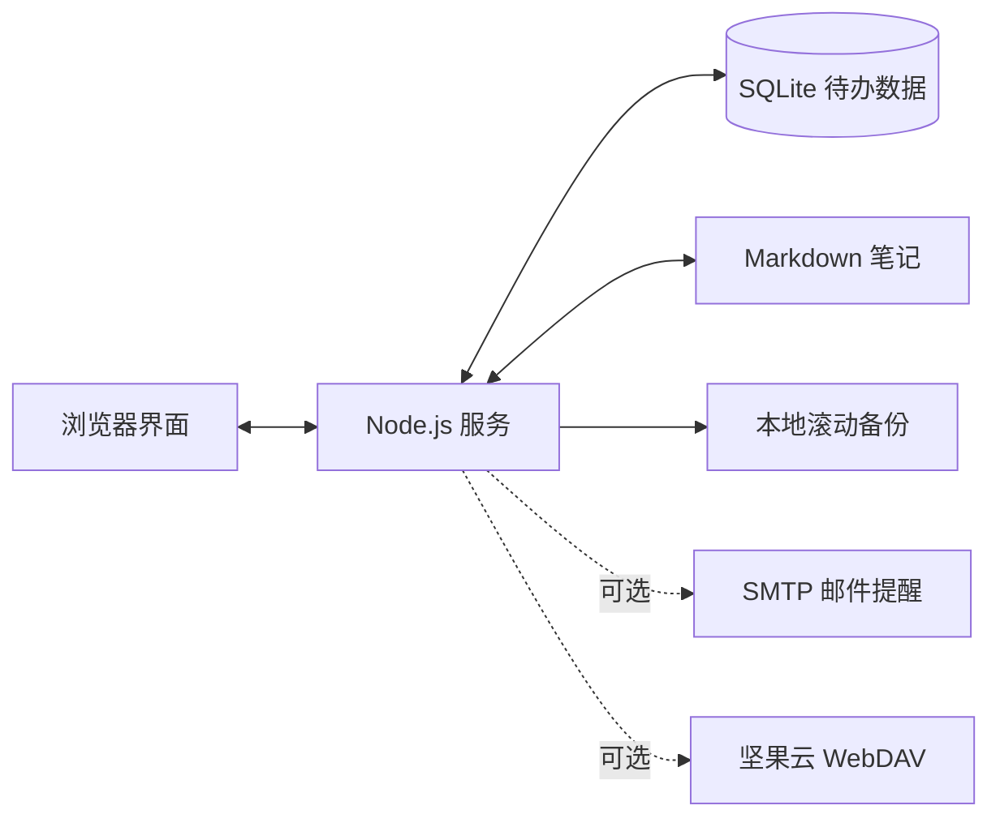

# Personal Todo Vault

<p align="center">
  <strong>把待办、进度、提醒与 Markdown 上下文留在自己的设备上。</strong>
</p>

<p align="center">
  <a href="https://github.com/nerkeler/personal-todo-vault/actions/workflows/ci.yml"></a>
  <a href="https://hub.docker.com/r/nerkeler/todo-app"></a>
  
  <a href="LICENSE"></a>
</p>

Personal Todo Vault 是一个面向个人与家庭服务器的自托管待办应用。它把待办清单、完成进度、预期完成时间、邮件提醒和 Markdown 笔记放在同一个界面里，运行数据保存为本机 SQLite 数据库和 Markdown 文件；需要异地备份时，可选择坚果云 WebDAV。

> [!WARNING]
> 应用目前没有登录、权限管理或多用户隔离。请只部署在本机、可信局域网、VPN，或带身份验证的 HTTPS 反向代理后面；不要直接把 8238 端口暴露到公网。


## 它适合什么场景

- 希望待办数据掌握在自己手中，不依赖外部任务管理 SaaS。
- 一个任务不止需要标题，还需要持续积累 Markdown 资料、步骤和复盘。
- 需要按预期完成时间查看日视图和月视图，同时保留轻量的快速创建体验。
- 想用邮件获得单次、每周或指定次数的提醒。
- 想把 SQLite 数据库和 Markdown 笔记增量备份到自己的坚果云空间。

## 核心能力

| 任务管理 | 时间与视图 | 数据与部署 |
|---|---|---|
| 分类、优先级、进度与完成状态 | 创建时默认今天，也可精确到小时和分钟 | SQLite 原子保存与本地滚动备份 |
| 每条待办关联独立 Markdown 笔记 | 列表、日、月三种视图 | 坚果云 WebDAV 增量备份与双向合并 |
| 移动端长按、桌面端右键打开操作菜单 | 月视图点击日期进入对应日视图 | Docker 多架构镜像：amd64 / arm64 |
| 自定义分类、图标与排序 | 单次、每周、指定次数邮件提醒 | 明暗主题与响应式布局 |

### 功能预览

<table>
  <tr>
    <td width="50%"><br><sub>邮件提醒：重复规则、快捷时间与分钟刻度</sub></td>
    <td width="50%"><br><sub>每条待办都可以拥有独立 Markdown 上下文</sub></td>
  </tr>
  <tr>
    <td colspan="2"><br><sub>SMTP 与坚果云 WebDAV 统一配置，密码不回显</sub></td>
  </tr>
</table>

## 快速部署

### Docker Compose（推荐）

公开镜像：[`nerkeler/todo-app:latest`](https://hub.docker.com/r/nerkeler/todo-app)

```bash
git clone https://github.com/nerkeler/personal-todo-vault.git
cd personal-todo-vault
mkdir -p data config
docker compose pull
docker compose up -d
```

打开 <http://127.0.0.1:8238/>。

运行数据会保存在当前目录：

```text
./data/      → /data    # todo.db、notes/、backups/
./config/    → /config  # 加密配置和机器本地密钥
```

更新镜像：

```bash
docker compose pull
docker compose up -d
```

### 单条 Docker 命令

```bash
docker run -d \
  --name personal-todo-vault \
  -p 8238:8238 \
  -e TZ=Asia/Shanghai \
  -v "$PWD/data:/data" \
  -v "$PWD/config:/config" \
  --restart unless-stopped \
  nerkeler/todo-app:latest
```

### 直接运行

需要 Node.js 22 或 24：

```bash
git clone https://github.com/nerkeler/personal-todo-vault.git
cd personal-todo-vault
npm ci
npm start
```

默认只监听 `127.0.0.1:8238`。可信局域网内可使用：

```bash
HOST=0.0.0.0 PORT=8238 npm start
```

## 使用方式

1. 在顶部输入标题，按需选择分类、优先级和预期完成时间，然后直接添加。
2. 通过列表视图处理任务，通过日视图聚焦当天，通过月视图观察时间分布。
3. 为长期任务增加进度；达到 100% 后任务会自动完成并停止提醒。
4. 打开笔记，为任务补充 Markdown 计划、链接和复盘。
5. 在配置中心设置 SMTP 与坚果云 WebDAV，并分别执行连接测试。

更完整的界面说明见 [USAGE.md](USAGE.md)，产品与技术约束见 [SPEC.md](SPEC.md)。

## 数据如何流动



- 待办、分类、进度和提醒规则保存在 `todo.db`。
- 每条笔记单独保存在 `notes/<todo-id>.md`。
- 本地数据库写入采用临时文件、`fsync` 和原子替换，并默认保留最近 10 份滚动备份。
- SMTP 与 WebDAV 设置保存在 `config.local.json`；配置包使用 AES-256-GCM 加密，密钥保存在 `config.local.key`。

## 云端备份与同步

配置中心支持坚果云 WebDAV：

```text
WebDAV 地址：https://dav.jianguoyun.com/dav/
账号：坚果云登录邮箱或账号
应用密码：坚果云第三方应用密码
备份目录：todo-app-backups（可修改）
```

云端目录结构：

```text
todo-app-backups/
├── objects/
│   ├── database/<sha256>.db.gz
│   └── notes/<sha256>.md.gz
├── snapshots/
│   └── YYYY-MM/<timestamp>-<random>.json
└── latest.json
```

- 数据库与每份 Markdown 笔记独立计算 SHA-256；只有新增或变化的对象会上传。
- 每次备份都生成完整快照清单，并按月份归档。
- “立即备份”是本地到云端的单向上传；“与云端同步”会先校验远端快照，再合并双方数据。
- 双方独有的待办都会保留；同一待办优先采用更新时间较新的版本，无法判断时保留本地并报告冲突。
- 合并前会在本机创建安全备份；切换失败会自动回滚。

首次配置建议按这个顺序操作：

1. 填写 WebDAV 地址、账号、应用密码和备份目录，点击“测试坚果云”。测试只使用当前表单，不会自动保存应用密码。
2. 测试成功后点击“保存配置”；保存完成后“立即备份”和“与云端同步”才会启用。
3. 如果目录中已有快照，首次使用请选择“与云端同步”，让本地数据与云端合并。
4. 如果目录可访问但还没有快照，同步会把当前本地数据创建为第一份快照。

为避免新容器或空白本地实例覆盖已有云端数据，“立即备份”在检测到本地仍是初始空数据、而云端已有有效快照时会主动停止，并提示先执行“与云端同步”。目录本身已经存在不会导致测试失败；只有认证、权限或快照内容异常时才会阻止后续操作。

> [!IMPORTANT]
> 云端对象使用 gzip 压缩和 SHA-256 完整性校验，但没有内容加密。请按明文敏感数据保护坚果云目录。WebDAV 密码和本机配置密钥不会上传。

## 恢复与迁移

配置中心的同步功能适合日常合并。明确需要用云端快照覆盖当前数据时，可使用恢复 API 或隔离恢复工具：

```bash
TODO_CONFIG_DIR=/config npm run restore -- --output-dir /data/restored-todo
```

恢复工具会在隔离目录中下载、解压并校验大小和 SHA-256，且拒绝覆盖已存在的目标目录。检查恢复结果后，再停止旧服务并切换数据目录。

旧版 `data.json` 可迁移到 SQLite：

```bash
TODO_DATA_DIR=/data npm run migrate
```

详细的强制迁移、指定快照和旧快照目录升级参数见 [USAGE.md](USAGE.md)。

## 网络与安全

- 默认监听本机地址；Docker 为了容器端口映射监听 `0.0.0.0`。
- 反向代理部署时，用 `TODO_ALLOWED_ORIGINS` 指定精确的 HTTPS Origin，多个来源用英文逗号分隔。
- 不要使用 `*`，也不要依赖未经信任的 `X-Forwarded-Proto` 判断来源。
- 不要提交 `todo.db`、`notes/`、`backups/`、`config.local.*`、`.env` 或任何应用密码。
- 跨公网使用时，推荐 VPN，或在 Caddy/Nginx 前增加 HTTPS 与身份验证。

常用环境变量示例见 [.env.example](.env.example)。

## 技术结构

| 层级 | 实现 |
|---|---|
| 前端 | 单文件原生 HTML、CSS、JavaScript |
| 服务端 | Node.js 原生 `http` 模块 |
| 数据库 | `sql.js` / SQLite WebAssembly |
| 邮件 | `nodemailer` |
| 云端备份 | HTTPS WebDAV |
| 容器 | Node.js 24 Bookworm Slim |

```text
personal-todo-vault/
├── index.html              # 页面、样式与交互
├── server.js               # HTTP API、提醒和备份调度
├── sqlite.js               # SQLite 初始化与原子保存
├── appConfig.js            # 本地配置加密与脱敏输出
├── cloudBackup.js          # WebDAV 增量备份、同步与恢复
├── email.js                # SMTP 邮件
├── restore.js              # 隔离恢复工具
├── migrate*.js             # 数据和快照迁移
├── test/                   # 发布回归测试
├── Dockerfile
└── docker-compose.yml
```

## 开发与发布检查

```bash
npm ci
npm run check
npm run test:release
docker build -t personal-todo-vault:local .
```

`npm run test:release` 使用临时目录、内存 WebDAV/SMTP 替身和 SQLite fixture，不会发送真实邮件或访问真实坚果云。GitHub Actions 会在 Node.js 22 与 24 上重复执行语法检查和发布回归。

## 许可证

[MIT](LICENSE) © 2026 nerkeler
